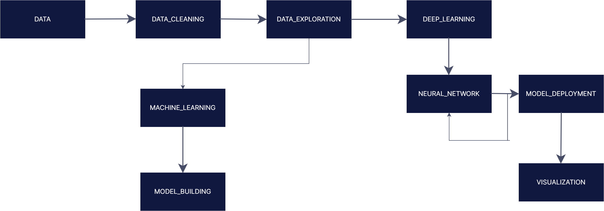

# Sales_prediciton
The data team identified factors such as promotions, competition, school and state holidays, seasonality, and locality as necessary for predicting the sales across the various stores.

Job is to build and serve an end-to-end product that delivers this prediction to analysts in the finance team.

# African language Speech Recognition - Speech-to-Text 

## Content
- [Overview](##overview)
- [Skills Implemented](##Sklls-Implemented)
- [ML pipeline Design](##ml-pipeline-design)
- [Notebooks] (## The tests from the modularized scripts are run in the following notebooks)
- [Dataset Features](#Dataset-Features)
- [Install](#install)


##  Overview

You work at Rossmann Pharmaceuticals as a Machine Learning Engineer. The finance team wants to forecast sales in all their stores across several cities six weeks ahead of time. Managers in individual stores rely on their years of experience as well as their personal judgment to forecast sales. 

The data team identified factors such as promotions, competition, school and state holidays, seasonality, and locality as necessary for predicting the sales across the various stores.

Your job is to build and serve an end-to-end product that delivers this prediction to analysts in the finance team. 

 

## Skills implemented
* data exploration and cleaning
* Working with audio as well as text files
* Familiarity with the deep learning architecture
* Model management (building ML catalog containing models, feature labels, and training model version)
* Training and validating DL models;  
* MLOps  with DVC, CML, and MLFlow

## ML Pipeline Design



## The tests from the modularized scripts are run in the following notebooks
* EDA analysis and Preprocessing ==> notebooks/Data_Exploration.ipynb
* Deep learning ==> notebooks/LSTM_forecasting.ipynb


## Install

```
clone https://github.com/dagmawiii03/dagmawiii03/Sales_prediction.git
pip install -r requirements.txt
```


[back to top](#content)


